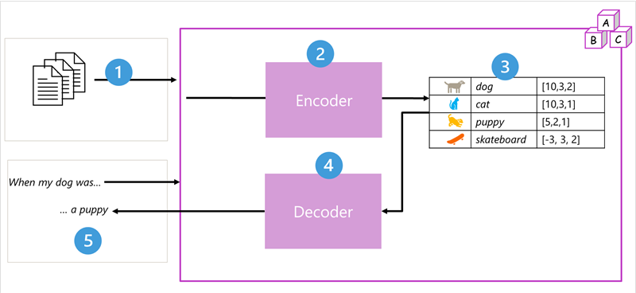

## 🤖 Fundamentals of Gen AI

|  | **Details** |
|--------------|-------------|
| 🧠 **Generative AI** | Describes a category of AI capabilities that create original content. |
| 📚 **Language Models** | Generative AI applications are powered by language models. |
| 🌐 **Large Language Models (LLMs)** | Trained on a wide range of general subject matter with many billions (even trillions) of parameters. |
| 📏 **Small Language Models (SLMs)** | Trained on smaller, more subject-focused datasets with fewer parameters than LLMs. |
| 🤖 **Transformer Models** | Trained with large volumes of text to represent semantic relationships and determine probable text sequences. |
| 🏗️ **Transformer Model Architecture** | - **Encoder Block**: Creates semantic representations of the training vocabulary.   - **Decoder Block**: Generates new language sequences. |
| ⚙️ **How Transformer Models Work** | 1. **Training Data**   2. **Tokenization**  3. **Embeddings**  4. **Encoding**: Generate a representation of the input text.   5. **Decoding**: Generate an appropriate natural language output, predicting an appropriate completion of the sentence. |
| 🏷️ **Specific Implementations** | - **BERT (Bidirectional Encoder Representations from Transformers)**: Developed by Google, uses only the encoder block.   - **GPT (Generative Pretrained Transformer)**: Developed by OpenAI, uses only the decoder block. |
| ✂️ **Tokenization** | Process of breaking text into tokens.|
| 💬 **Embeddings** |**CONTEXTUAL VECTORS** that represent tokens in a multi-dimensional space. |
| 🔍 **Word2Vec** | A TECHNIQUE to calculate appropriate embeddings for a given set of tokens. |
| 🎯 **Attention Layer** | Assigns a numeric weight to each token to quantify the strength of the relationships between tokens.    - **Encoder**: Quantifies the strength of the relationships between tokens.   - **Decoder**: Predicts the next token in a sequence based on the attention weights. |
| 🗂️ **Azure Model Catalog** | - OpenAI   - HuggingFace   - Mistral   - Meta and others. |
| 🛠️ **Copilots** | Based on an open architecture, allowing third-party developers to create or extend their own copilots. |
| 🖥️ **Copilot Studio** | SaaS platform to customize Microsoft copilot or develop custom copilots. |
| ☁️ **Azure AI Studio** | PaaS platform providing full control over the language model. |
| 📞 **Copilot in Dynamics 365 Customer Service** | Assists contact centers with generative AI capabilities. |
| 💼 **Copilot for Dynamics 365 Sales** | Helps sales professionals with generative AI tools. |
| 🛒 **Copilot for Dynamics 365 Supply Chain** | Manages changes to purchase orders. |
| 📊 **Copilot in Microsoft Fabric** | Allows analysts to automatically generate code. |
| 📈 **Copilot in Power BI** | Analyzes data to provide insights and visualizations. |
| 🔐 **Microsoft Copilot for Security** | Assists security professionals with AI-driven insights and tools. |
| 🖧 **Microsoft Copilot for Azure** | Supports infrastructure administrators with generative AI capabilities. |
