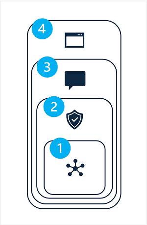

## 🛡 Responsible GEN AI

| Stage                     | Process and Details                                                             |
|---------------------------|---------------------------------------------------------------------------------|
| **Identify potential harms** | 1. Identify 2. Prioritize 3. Test and verify its presence 4. Document and share findings |
| **Measure**               | 1. Measure the impact of harms 2. Manual & Automatic testing                  |
| **Mitigate**              | **Layer Approach:** 3.1. Model: Selecting a model, Fine-tuning a foundational model 3.2. Safety System: Content filters to suppress prompts and responses, detection algorithms 3.3. Metaprompt and grounding: Construction of prompts 3.4. User experience: Designing the application user interface to constrain inputs to specific subjects or types, or applying input and output validation 
|
| **Operate**               | Review the system and its documentation                                          |
